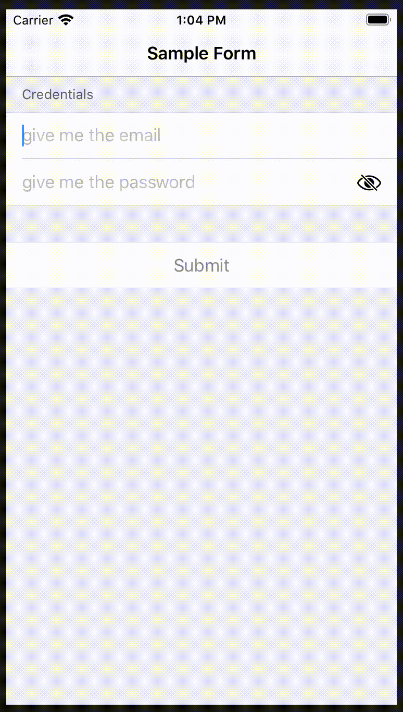

## Field Validator Library for SwiftUI

[](https://cocoadocs.org/docsets/FieldValidatorLibrary)
[](https://cocoadocs.org/docsets/FieldValidatorLibrary)

[SwiftUI](https://developer.apple.com/documentation/swiftui) [Package](https://swift.org/package-manager/) supporting "Form Validation"

Take a look to [Build field validator for SwiftUI](https://soulsoftware-bsc.blogspot.com/2019/10/build-field-validator-for-swiftui.html) and in folder [Example](Example) for a reference implementation

## Import library

### Swift Package Manager

This Library is compatible with [Swift Package Manager](https://swift.org/package-manager/)

### Cocoapods

This Library is compatible with [Cocoapods](https://cocoapods.org).

In your **Podfile** add
```
pod 'FieldValidatorLibrary', '~> 1.5.0'
```

## Sample

### Version 1.5.x

```swift
struct FormWithValidatorV1_5 : View {

    @EnvironmentObject var item:DataItem // data model reference

    @StateObject var usernameValid = FieldChecker2<String>() // validation state of username field
    @StateObject var passwordValid = FieldChecker2<String>() // validation state of password field

    func username() -> some View {

        TextField( "give me the email",
                   text: $item.username.onValidate(checker: usernameValid) { v in
                        // validation closure where ‘v’ is the current value
                        if( v.isEmpty ) {
                            return "email cannot be empty"
                        }
                        if( !v.isEmail() ) {
                            return "email is not in correct format"
                        }
                        return nil
                   }, onCommit: submit)
                .autocapitalization(.none)
                .padding( .bottom, 25 )
                .modifier( ValidatorMessageModifier(message: usernameValid.errorMessage))
    }

    func passwordToggle() -> some View  {

        SecureField( "give me the password",
            text:$item.password.onValidate( checker: passwordValid ) { v in
                if( v.isEmpty ) {
                    return "password cannot be empty"
                }
                return nil
            } )
        .autocapitalization(.none)
        .padding( .bottom, 25  )
        .modifier( ValidatorMessageModifier(message: usernameValid.errorMessage))
    }

    var isValid:Bool {
      passwordValid.valid && usernameValid.valid
    }

    func submit() {
        if( isValid ) {
            print( "submit:\nusername:\(self.item.username)\npassword:\(self.item.password)")
        }
    }

    var body: some View {
        NavigationView {
        Form {
            Section(header: Text("Credentials")) {
                username()
                passwordToggle()
            } // end of section
            Section {
                HStack {
                    Spacer()
                    Button( "Submit", action: submit )
                    // enable button only if username and password are validb
                    .disabled( !self.isValid )
                    Spacer()
                }
            } // end of section
        } // end of form
       .navigationBarTitle( Text( "Validation 1.5 Sample" ), displayMode: .inline  )
        } // NavigationView
    }
}

```

### Version 1.4.x

```swift

struct FormWithValidatorV1 : View {

    @EnvironmentObject var item:DataItem // data model reference
    @State var usernameValid = FieldChecker() // validation state of username field
    @State var passwordValid = FieldChecker() // validation state of password field
    @State var passwordToggleValid = FieldChecker() // validation state of password field

    func username() -> some View {
        TextFieldWithValidator( title: "give me the email",
                                value: $item.username,
                                checker: $usernameValid,
                                onCommit: submit) { v in
                         // validation closure where ‘v’ is the current value

                            if( v.isEmpty ) {
                                return "email cannot be empty"
                            }
                            if( !v.isEmail() ) {
                                return "email is not in correct format"
                            }

                            return nil
                    }
                    .autocapitalization(.none)
                    .padding( .bottom, 25 )
                    .modifier( ValidatorMessageModifier(message: usernameValid.errorMessageOrNilAtBeginning ) )
    }

    func passwordToggle() -> some View  {
      SecureFieldWithValidator(   title: "give me the password"
                                  value:$item.password,
                                  checker:$passwordToggleValid ) { v in

                              if( v.isEmpty ) {
                                  return "password cannot be empty"
                              }
                              return nil
      }
      .autocapitalization(.none)
      .padding( .bottom, 25  )
      .modifier( ValidatorMessageModifier(message: passwordToggleValid.errorMessage ) )

    }

    var isValid:Bool {
        passwordToggleValid.valid && usernameValid.valid
    }

    func submit() {
        if( isValid ) {
            print( "submit:\nusername:\(self.item.username)\npassword:\(self.item.password)")
        }
    }

    var body: some View {
        NavigationView {
        Form {
            Section(header: Text("Credentials")) {
                username()
                passwordToggle()
            } // end of section

            Section {
                HStack {
                    Spacer()
                    Button( "Submit" ) { self.submit() }
                    // enable button only if username and password are valid
                    .disabled( !self.isValid )
                    Spacer()
                }
            } // end of section
        } // end of form
       .navigationBarTitle( Text( "Sample Form" ), displayMode: .inline  )
        } // NavigationView
    }
}

```


