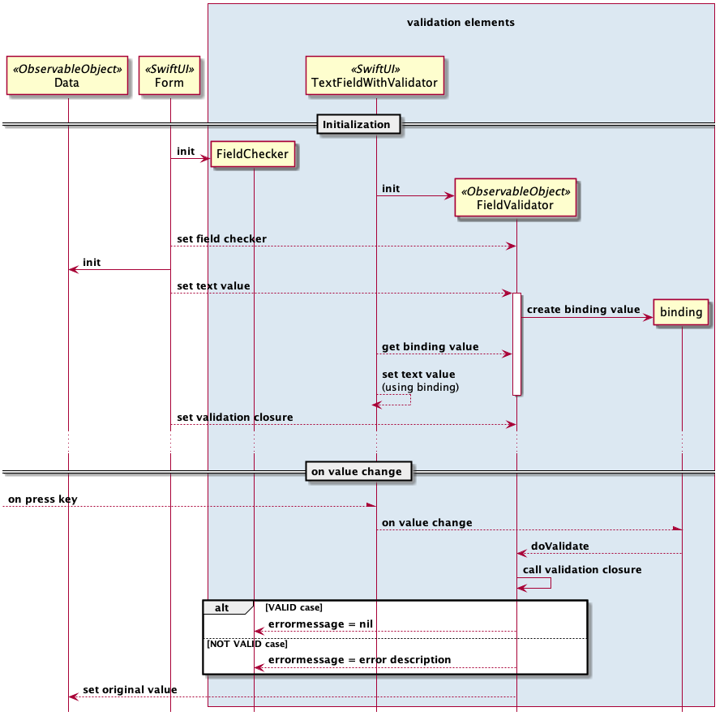

# Develop a TextField validator for SwiftUI

# Rise of SwiftUI

As many of us when Apple announced in WWDC19 the SwiftUI I couldn’t wait to test it.

I’ve joined macosx and xcode beta to start developing with this new declarative way to develop UI in Apple eco-system

## The UI development before SwiftUI

### At beginning was ‘XIB’

I’ve started developing with IOS when Objective-C was the only language available and **XIB** seemed to me an incredible way to design/implement mobile screens.

### After that the ‘Storyboard’

Landing of Swift and **Storyboard** seemed to me a revolution but while storyboard was amazing, simple and intuitive concerning the swift migration has been more complex than imagined in particular for an initial forced coexistence with the stuff already built with Objective-C.

However the rapid swift evolution and the modernity of such language has convinced me and many others to move as fast as possible the development lifecycle entirely on Swift also migrating the Objective-C stuff when possible.

### At the end the ‘Auto layout’

Concerning UI development the introduction of **auto layout** seemed a great innovation (really already seen in other platform) and in my opinion the value added was in the simplicity to add auto layout rules using UI editor in XCode.

## Landing of SwiftUI

All the above considerations are to describe the context of IOS development before arrival of SwiftUI. Summarizing in the classic approach an IOS developer has to deal with UI using XIB, StoryBoard and auto-layout through graphical editor provided by XCode while the coding is based on Swift. This means that we have to do context switch from Graphical Tool and code during development lifecycle.

Apple has decided to change this approach introducing a pure code way to develop UI without need to use graphical editor anymore introducing SwiftUI framework a kind of Domain Specific Language (DSL) to describe in declarative way the User Interface and theirs interactions.

One of the great advantages in my point-of-view, is that SwiftUI is supported on all the Apple OSs so we can use one approach for IOS, IPadOS, MacOS, watchOS, TvOS but, take note that, we’ll reuse the approach but not (completely) the written code, we could say that SwiftUI promote the concept:

                      "Learn Once, Apply Everywhere"

After announcing of SwiftUI I was very interested and from the first beta I immediately started to develop with this new framework trying to refactor a simple app to better understand the value provided from developer point-of-view.

In the continuation of this article let assume  that you are familiar with basic concepts of SwiftUI programming.

## Learn SwiftUI implementing a use case: ‘form validation’

When I started to deal with SwiftUI Form element immediately I’ve had the need to validate input field and rather than reuse the swift library already used in pre-SwiftUI world I’ve tried to develop a TextField Validator following the philosophy of this new framework. Below I’ll share my implementation and criterias used for it, first I've defined a validator closure as shown below

```javascript
// MARK: Validation Closure
typealias Validator = (T) -> String?
```

Where T is the value to validate and the result is an optional string that if = nil means that data is valid otherwise it contains description of error that could be displayed to the user.

Such closure should be invoked for each time the TextField value change but, not-like classical approach based on handling events, we’ll use the SwiftUI binding concept so let introduce the `FieldValidator` class that will be responsible to validate value

The main elements of the following implementation are `FieldChecker` ([snippet 1]()) and `FieldValidator` ([snippet 2]()), where `FieldChecker` is a struct that holds the last error message (if occurred) while `FieldValidator` validate the value passed to it updating in consequence the `FieldChecker` passed to it.

#### Snippet 1 - FieldChecker

```javascript
// MARK: FieldChecker holds last error message or nil if valid </td>
struct FieldChecker {
    var errorMessage:String? = nil
    var valid:Bool { self.errorMessage == nil }
}
```

#### Snippet 2 - FieldValidator

```javascript
// MARK: FieldValidator validate the value changes updating the FieldChecker
class FieldValidator<T> : ObservableObject where T : Hashable {

    // specialize validator for TestField ( T = String )    
    typealias Validator = (T) -> String?

    @Binding private var bindValue:T
    @Binding private var checker:FieldChecker

    @Published var value:T {
        willSet { self.doValidate(newValue) }
        didSet { self.bindValue = self.value }
    }
    private let validator:Validator

    var isValid:Bool { self.checker.valid }
    var errorMessage:String? { self.checker.errorMessage }

    init( _ value:Binding<T>,
          checker:Binding<FieldChecker>,
        validator:@escaping Validator  )
    {
        Self.validator  = validator
        self._bindValue = value
        self.value      = value.wrappedValue
        self._checker   = checker
    }

    func doValidate( _ newValue:T? = nil ) -> Void {
        self.checker.errorMessage = (newValue != nil) ?
             self.validator( newValue! ) :
             self.validator( self.value )
    }

} // end class FieldValidator
```

As you see `FieldValidator` is an ObservableObject that has the ability to publish properties whose values can be bounded and observed.

The main attributes are:

* bindValue a `@Binding` attribute that will hold the reference to original value owned by TextField

* checker  a `@Binding` attribute that will hold the reference to the object that will contain the optional errorMessage

* value a `@Published` property that represent the field value and will apply every update to the bindVaue (delegator)

* validator a private attribute that will contain the custom validation code provided as closure

The constructor initialize the bindValue, checker and validator.

The main method is doValidate that exec provided validator and store result into `FieldChecker`

Now we have to set up interaction between the `FieldValidator` to TextView implementing a standard way to present to the user input errors.

So we  need to create a SwiftUI view  this is a simple implementation named TextFieldWithValidator ([snippet 3]()) where we initialize a `FieldValidator` instance named **field** with information provided to the view and pass to TextField  the validator value TextField( title ?? "", text: $field.value ) that will intercept, validate and notify changes (remember it is a @Publish property) moreover we declare that  border will be Red if the `FieldValidator` instance  (i.e. field) is not valid `.border( field.isValid ? Color.clear : Color.red )`, in the same way we add a Text under to the TextField that will contain the eventual error message.

### Snippet 3 - TextFieldWithValidator

```javascript
struct TextFieldWithValidator : View {
    // specialize validator for TestField ( T = String )
    typealias Validator = (String) -> String?     

    var title:String?

    @ObservedObject var field:FieldValidator<String>

    init( title:String = "", value:Binding<String>,
                           checker:Binding<FieldChecker>,
                         validator:@escaping Validator )
    {
        self.title = title;
        self.field = FieldValidator(value, checker:checker, validator:validator )

    }

    var body: some View {
        VStack {
            TextField( title ?? "", text: $field.value )
                .padding(.all)
                .border( field.isValid ? Color.clear : Color.red )
                .onAppear { self.field.doValidate() } // run validation on appear
                if( !field.isValid  ) {
                    Text( field.errorMessage ?? "" )
                        .fontWeight(.light)
                        .font(.footnote)
                        .foregroundColor(Color.red)
                }
        }
    }
}
```

Well we have almost finished, now all we have to do is implement a simple use case applying it in a SwiftUI Form, so let create as simple login form with username and password fields following the steps outlined below:

1. Create an observable (bindable) data model:

```javascript
class DataItem: ObservableObject { // observable object

    @Published var username:String = "" // observable property
    @Published var password:String = "" // observable property

}
```

2. Create a FormWithValidator view that will contain the input fields and validation logic. In this case we have simply considered empty field as not valid

```javascript
struct FormVithValidator : View {

 @ObservedObject var item:DataItem // data model reference  

 @State var usernameValid = FieldChecker() // validation state of username field
 @State var passwordValid = FieldChecker() // validation state of password field

 var body: some View {

  Form {


   Section {                 


     TextFieldWithValidator( title:"username",
                            value: $item.username, checker:$usernameValid ) { v in
                      // validation closure where ‘v’ is the current value

                         if( v.isEmpty ) {
                             return "username cannot be empty"
                         }

                         return nil
                 }
                 .autocapitalization(.none)


    TextFieldWithValidator( title:"password",
                            value: $item.password, checker:$passwordValid ) { v in
                      // validation closure where ‘v’ is the current value

                         if( v.isEmpty ) {
                             return "password cannot be empty"
                         }

                         return nil
                 }
                 .autocapitalization(.none)
   } // end of section

   Section {

    Button( "Submit" ) {                   
    }
    // enable button only if username and password are valid
   .disabled( !(passwordValid.valid && usernameValid.valid) )
   } // end of section

  } // end of form
 }
}
```

3. In the SceneDelegate creates an instance of data and pass to them to form

```javascript
let item = DataItem()// instance of data

// create a viewController from the FormWithValidator SwiftUI view
let vc = UIHostingController(rootView: FormVithValidator( item:item))

window.rootViewController = vc // set viewController as root

```

Et voilà the form with validation has been completed.

To better understand how these elements work together below I’ve drawn a simple sequence diagram of the solution



# Conclusions

In this exercise I’ve applied all the new concepts that I’ve learned in my journey through SwiftUI, hope this could help you to better understand this new amazing approach and in case also provide you a lightweight framework on which to build your form validation strategy.
> The code of the article is on [GITHUB](https://github.com/bsorrentino/swiftui-fieldvalidator)

**Happy coding and … enjoy SwiftUI**
